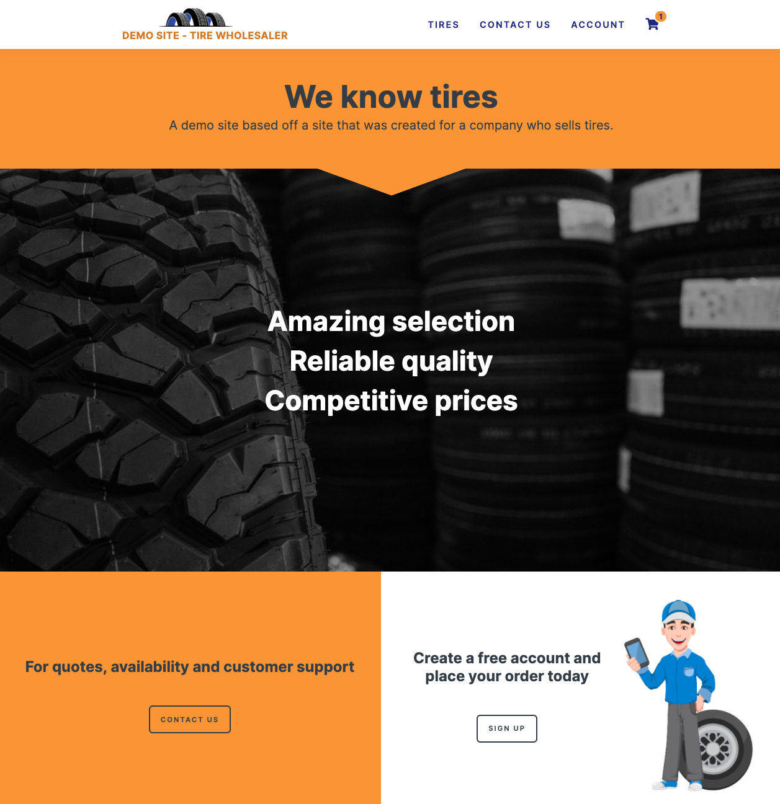

# Full-Stack site for a tire wholesale company (in development)

This client needed a brand new website that would enable them to keep track of inventory, allow clients to register for an account, place orders, and keep track of invoices. There was no need for e-commerce due to the process that payments were taken. While a significant portion of the business will be done on computers with large monitors, we ensured that the application is completely responsive.

## Technologies Used
+ HTML
+ CSS
+ JavaScript
+ Python
+ Django
+ PostgreSQL
+ Amazon Web Service
+ Gmail web services

## Special features

- Signing up: Users can sign up but can only place and order once their account has been verified. Email notifications have been built in to notify both the admins and the users of new and verified accounts
- User account: Once a user has been verified they can sign in and place orders. If they need to update their account they can do so but will be warned by the system that their account will need to be re-verified before being able to use the account again.
- Maintaining inventory: Admins can easily add tires to the database, increase and decrease stock, and discount prices. 
- Searching inventory: Tire informaiton can be very complex so this site has a robust search option. Once users find what they need they can add to their cart with the click of a button.
- Shopping: The cart details out everything a user needs to know about their potential purchase and each item will link to the specific tire for more detail. With the click of a button an order can be placed and an admin is immediately notified by email.
- Orders and invoices: Orders and their status are easily displayed in the users account information. Once an order has been shipped a user is notified by email with an invoice. They can also go to past purchases and with the click of a button get an invoice emailed to them again.
- Full admin functionality: Admins have an amazingly robust portal where they can manage inventory, orders, and users on a bulk basis

#### Homepage
 

#### Login

#### Account

#### Tire search

#### Order/Invoice

#### Admin

